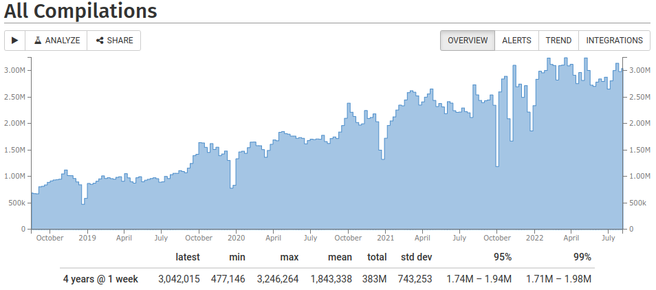

## Behind the Scenes
<!-- .element: class="white-bg" -->


<!-- .element: height="500" -->


<div>

## But really...

* node.js
* Amazon Web Services
* CloudFront / Load Balancers
* 3-5 EC2 instances
* EFS / S3 / DynamoDb

</div><!-- .element: class="white-bg" -->


<!-- .element: class="no-border" -->


## CE stats
<!-- .element: class="white-bg" -->

<!-- .element: class="no-border stretch white-bg" -->


<div>

## CE stats

* 950k compiles per week
* 1.5/sec average
* 4/sec peak
* 3000 short URLs/week

</div><!-- .element: class="white-bg" -->


<div>

## Compiler stats

* 400+ compilers
* 250+GB

<div class="lang-container">
<div>Ada</div>
<div>Analysis</div>
<div>Assembly</div>
<div>C</div>
<div>C++</div>
<div>Clean</div>
<div>Cppx</div>
<div>CUDA</div>
<div>D</div>
<div>Fortran</div>
<div>Go</div>
<div>Haskell</div>
<div>ispc</div>
<div>LLVM IR</div>
<div>OCaml</div>
<div>Pascal</div>
<div>Rust</div>
<div>Swift</div>
<div>Zig</div>
</div><!-- -->

</div><!-- .element: class="white-bg" -->


## Maintaining

```
admin-node ~> ce --env prod instances list
Address          State      Type       ELB     Service  Version       
34.226.244.207   running    t3.medium  healthy running  3965 (master) 
3.91.14.221      running    c5.large   healthy running  3965 (master) 

admin-node ~> ce --env prod builds list
Live  Branch     Version    Size       Hash          
 -->  master     3965       58.2MiB    969925..8b69c5
      master     3979       58.2MiB    9410c2..fbc044
      policy-... 3983       58.2MiB    27eccb..62da61

admin-node ~> ce --env prod builds set_current 3979
admin-node ~> ce --env prod instances restart
```


## Compilers

* Built with custom docker containers
* Daily process
* [World's worst CI](https://godbolt.org/admin/builds.html)
* Takes 4+hr/day on fast machine (c5d.4xlarge)


## Monitoring

* [papertrail](https://papertrailapp.com/events) - live event monitoring
* [AWS Dashboard](https://console.aws.amazon.com/cloudwatch/home?region=us-east-1#dashboards:name=CompilerExplorer)
* [stathat](https://www.stathat.com/v) - aggregate statistics
* [Google Analytics](https://analytics.google.com/analytics/web/?hl=en-GB&pli=1#/report/visitors-overview/a55180w58851134p60096530/)
* [sentry](https://sentry.io/organizations/compiler-explorer/issues) - javascript error aggregation
* [StatusCake](https://app.statuscake.com/UptimeStatus.php?tid=1813107) - uptime monitoring


## When things go wrong

<!-- .element: height="500" -->


## When things go wrong

<ul>
<li>[Bad config](https://cpplang.slack.com/archives/C7ETT0ZRP/p1534332219000100) (August 2018)</li>
<li class=fragment>[EFS transfer limit](https://www.patreon.com/posts/11241143) (May 2017)<p>
      <!-- .element: height="200" --></li>
<li class=fragment>[S3 outage](https://aws.amazon.com/message/41926/) (Feb 2017)</li>
</ul>
