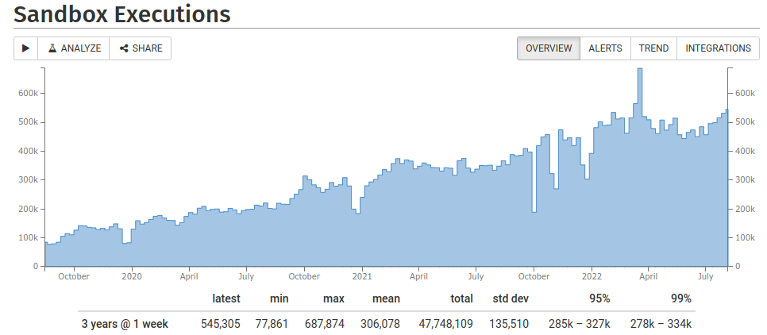

## Behind the Scenes
<!-- .element: class="white-bg" -->

---


<!-- .element: height="500" -->

---

<div>

## More boringly...

* node.js
* Amazon Web Services
* CloudFront / Load Balancers
* 3-16 EC2 instances
* EFS / S3 / DynamoDb
* Custom GH runners

</div><!-- .element: class="white-bg" -->

---

<!-- .element: class="no-border" -->

---

## CE stats
<!-- .element: class="white-bg" -->

<!-- .element: class="no-border stretch white-bg" -->

---

## CE stats
<!-- .element: class="white-bg" -->

<!-- .element: class="no-border stretch white-bg" -->

---

<div>

## CE stats

[stats.compiler-explorer.com](https://stats.compiler-explorer.com)

</div><!-- .element: class="white-bg" -->

---

<div>

## CE stats

* 3,000,000 compiles per week
* 5/sec average
* 10/sec peak
* 600,000 executions per week
* 6,000 short URLs per week

</div><!-- .element: class="white-bg" -->

---

<div class="white-bg">

## Compiler stats

* 800+ compilers
* 1.2TB

<div class="lang-container">
<div>Ada</div>
<div>Analysis</div>
<div>Assembly</div>
<div>C</div>
<div>Carbon</div>
<div>C++ ("Cppx", "gold", "blue")</div>
<div>Clean</div>
<div>CUDA</div>
<div>D</div>
<div>Fortran</div>
<div>Go</div>
<div>Haskell</div>
<div>ispc</div>
<div>Java</div>
<div>LLVM IR</div>
<div>Nim</div>
<div>OCaml</div>
<div>Pascal</div>
<div>Python</div>
<div>Rust</div>
<div>Swift</div>
<div>Zig</div>
</div><!-- -->

</div>

---

<div class="white-bg">

## Maintaining

```
admin-node ~> ce --env prod instances status
Address       State    Type       ELB     Service  Version       
172.30.0.151  running  c6i.large  healthy running  gh-3952 (main)
172.30.4.9    running  c5a.large  healthy running  gh-3952 (main)

admin-node ~> ce --env prod builds list
Live  Branch     Version    Size       Hash          
 -->  main       gh-3952    48.4MiB    b0046e..dc35cd
      main       gh-3986    48.4MiB    a3327d..877a20
      mg/testing gh-3668    48.6MiB    8b7f7e..b212f3

admin-node ~> ce --env prod builds set_current gh-3986
admin-node ~> ce --env prod environment refresh
```

</div>

---

<div class="white-bg">

## Compilers

* Built with custom docker containers
* Daily process
* Custom [GH actions runners](https://github.com/compiler-explorer/compiler-workflows/actions)
* Runs on 8xlarge and 16xlarge instances

</div>

---

<div class="white-bg">

## Security

* Compilers
* User execution
* [nsjail](https://github.com/google/nsjail)

</div>

---

<div class="white-bg">

## Monitoring

* [papertrail](https://papertrailapp.com/events) - live event monitoring
* [AWS Dashboard](https://console.aws.amazon.com/cloudwatch/home?region=us-east-1#dashboards:name=CompilerExplorer)
* [stathat](https://www.stathat.com/v) - aggregate statistics
* [Grafana](https://ce.grafana.net) - more fine-grained stats
* [Google Analytics](https://analytics.google.com/analytics/web/?hl=en-GB&pli=1#/report/visitors-overview/a55180w58851134p60096530/)
* [sentry](https://sentry.io/organizations/compiler-explorer/issues) - javascript error aggregation
* [StatusCake](https://app.statuscake.com/UptimeStatus.php?tid=1813107) - uptime monitoring

</div>

---

<div class="white-bg">

## When things go wrong

<!-- .element: height="500" -->

* ~10h downtime since 2017-01-23
* 99.99956% uptime
* (real answer is more like 70h)

</div>

---

<div class="white-bg">

#### When things go wrong

<ul>
<li>

[Bad config](https://cpplang.slack.com/archives/C7ETT0ZRP/p1534332219000100) (August 2018)

</li>
<li class=fragment>

[EFS transfer limit](https://www.patreon.com/posts/11241143) (May 2017)<p>
      <!-- .element: height="200" -->
      
</li>
<li class=fragment>

[S3 outage](https://aws.amazon.com/message/41926/) (Feb 2017)

</li>
<li class=fragment>

[EFS/NFS/bind mount/systemd](https://patchwork.kernel.org/patch/10104257/) catastrophe (September 2019)

</li>
</ul>

</div>
