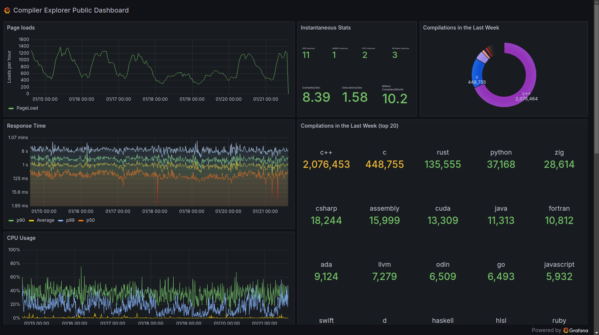
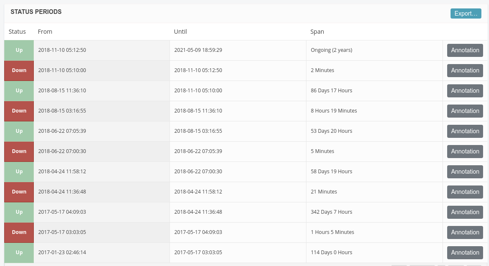

## Behind the Scenes
<!-- .element: class="white-bg" -->

---


<!-- .element: height="500" -->

---

<div>

## More boringly...

<div class="col2">
<div>

* node.js
* Amazon Web Services
* GitHub actions
  - with custom runners
* CloudFront / Load Balancers

</div>
<div>

* 5-30 EC2 instances
  - x86 Linux
  - x86 Windows
  - ARM Linux
  - GPU enabled
* EFS / S3 / DynamoDb / Athena

</div>
</div>
</div><!-- .element: class="white-bg" -->

---

## System diagram
<!-- .element: class="white-bg" -->

<!-- .element: class="no-border" -->

---

<div>

## Public stats

<!-- .element: height="400" -->

[stats.compiler-explorer.com](https://stats.compiler-explorer.com)


</div><!-- .element: class="white-bg" -->

---

<div>

## CE stats

* 1,000 page loads per hour
* 10,000,000+ compiles per week (8/sec)
* 400,000+ executions per week
* 7,000 short URLs per week

</div><!-- .element: class="white-bg" -->

---

<div class="white-bg">

## Compiler stats

* 3000+ compilers
* 3.5+ TB
* Biggest current infra problem!

<div class="lang-container">
<div>Ada</div>
<div>Analysis</div>
<div>Assembly</div>
<div>C++ (and many variants)</div>
<div>C</div>
<div>Clean</div>
<div>COBOL</div>
<div>Cppx</div>
<div>Crystal</div>
<div>CUDA</div>
<div>D</div>
<div>Erlang</div>
<div>Fortran</div>
<div>GIMPLE</div>
<div>Go</div>
<div>Haskell</div>
<div>Hylo</div>
<div>ispc</div>
<div>Java</div>
<div>Kotlin</div>
<div>LLVM IR</div>
<div>Nim</div>
<div>OCaml</div>
<div>Odin</div>
<div>Pascal</div>
<div>Pony</div>
<div>Racket</div>
<div>Ruby</div>
<div>Rust</div>
<div>Swift</div>
<div>Vala</div>
<div>WAWM</div>
<div>Zig</div>
</div><!-- -->

</div>

---

<div class="white-bg">

## Maintaining

```
admin-node ~> ce --env prod instances list
Address          State      Type       ELB     Service  Version
34.226.244.207   running    t3.medium  healthy running  3965 (main)
3.91.14.221      running    c5.large   healthy running  3965 (main)

admin-node ~> ce --env prod builds list
Live  Branch     Version    Size       Hash
 -->  main       3965       58.2MiB    969925..8b69c5
      main       3979       58.2MiB    9410c2..fbc044
      policy-... 3983       58.2MiB    27eccb..62da61

admin-node ~> ce --env prod builds set_current 3979
admin-node ~> ce --env prod environment refresh
```

</div>

---

<div class="white-bg">

## Compilers

* Custom docker containers
* Built with [Daily process](https://github.com/compiler-explorer/compiler-workflows/blob/main/build-status.md)
* Custom GitHub runners

</div>

---

<div class="white-bg">

## Security

* Compilers
* User execution
* [nsjail](https://github.com/google/nsjail)
* [cewrapper](https://github.com/compiler-explorer/cewrapper) on Windows

</div>

---

<div class="white-bg">

## Monitoring

* [Grafana](https://ce.grafana.net) - fine-grained statistics
* [papertrail](https://papertrailapp.com/events) - live event monitoring
* [AWS Dashboard](https://console.aws.amazon.com/cloudwatch/home?region=us-east-1#dashboards:name=CompilerExplorer)
* [sentry](https://sentry.io/organizations/compiler-explorer/issues) - browser error aggregation
* [stathat](https://www.stathat.com/v) - aggregate statistics
* [StatusCake](https://app.statuscake.com/UptimeStatus.php?tid=1813107) - uptime monitoring

</div>

---

## When things go wrong<!-- .element: class="white-bg" -->

<!-- .element: height="500" -->

---

<div class="white-bg">

## When things go wrong

<ul>
<li>

[Bad config](https://cpplang.slack.com/archives/C7ETT0ZRP/p1534332219000100) (August 2018)


<!-- .element: class="fragment" -->

</li>
<li class=fragment>

[EFS transfer limit](https://www.patreon.com/posts/11241143) (May 2017)<p>
      <!-- .element: height="200" -->

</li>
<li class=fragment>

[S3 outage](https://aws.amazon.com/message/41926/) (Feb 2017)

</li>
<li class=fragment>

[EFS/NFS/bind mount/systemd](https://patchwork.kernel.org/patch/10104257/) catastrophe (September 2019)

</li>
</ul>

</div>
