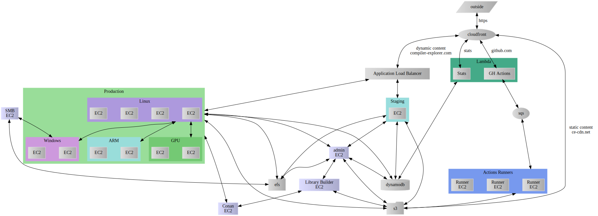

## Behind the Scenes
<!-- .element: class="white-bg" -->

<!-- .element: class="white-bg" -->

## But really...

* Amazon Web Services
* 3-5 EC2 instances
* CloudFront
* Application Load Balancers
* EFS

<!-- .element: class="white-bg" -->

<!-- .element: class="white-bg" -->

## CE stats
<!-- .element: class="no-border stretch white-bg" -->

* 950,000 compilations per week
* avg 1.5/second, peak 4/second

<!-- .element: class="white-bg" -->

