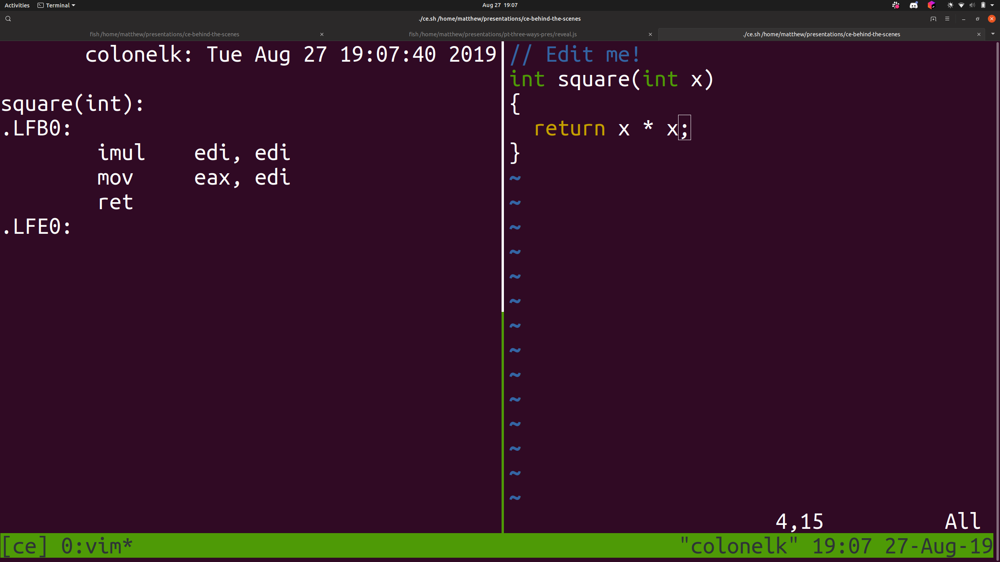
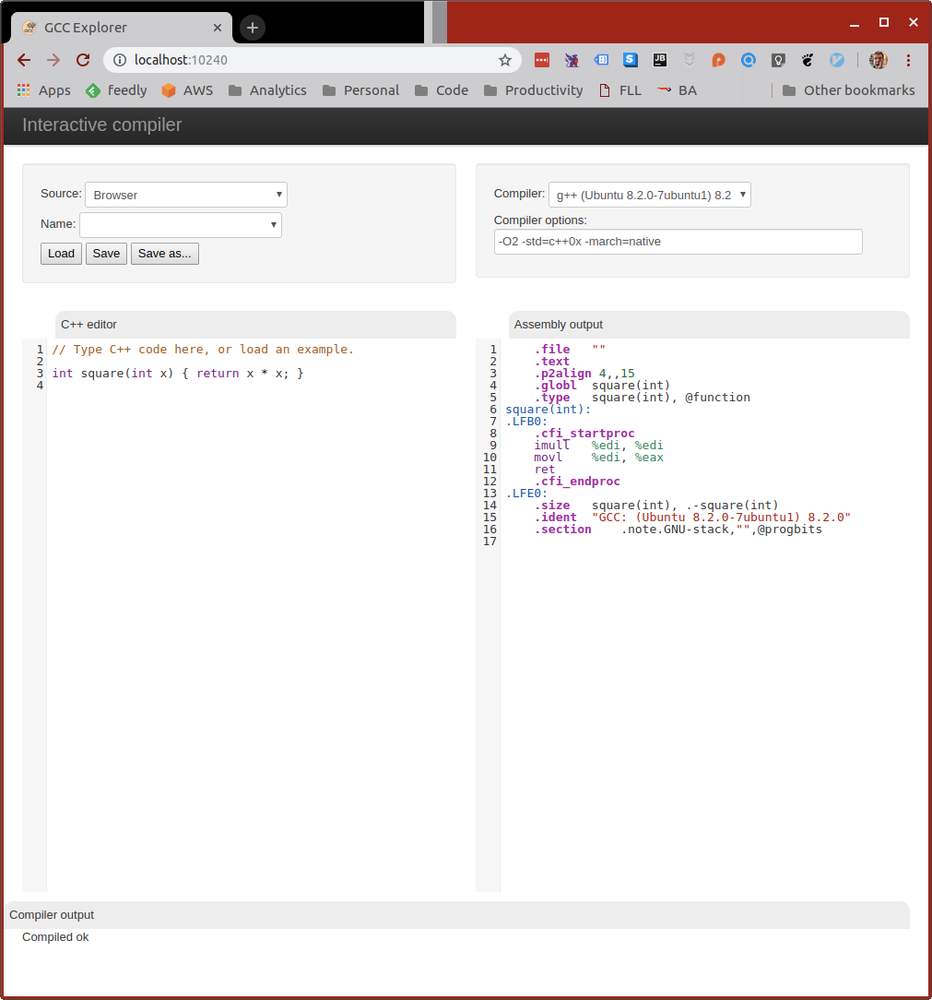
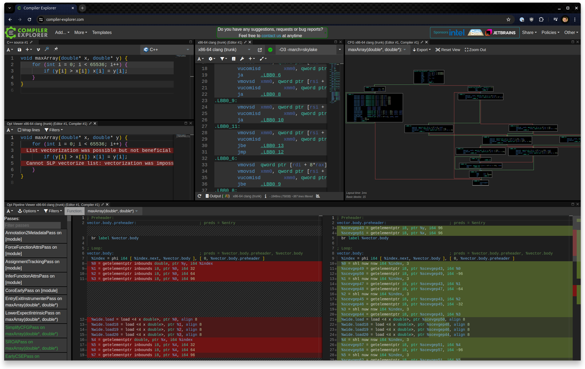

<div class="white-bg">

### Overview
* Who am I?
* What is Compiler Explorer?
* Some Cool Features
* Behind the Scenes

<div class="fragment">

**BUT** This is interactive! Interrupt and ask questions.

</div>

</div>

---
    
<div class="white-bg">

### About me

* Decade of making PC & console games
* Writing C++ tools
* Google, YouTube mobile
* Low-Latency Finance
* But then...<!-- .element: class="fragment" -->

</div>

---

<div class="white-bg">

 <!-- .element: class="no-border stretch" -->

</div>

---

<div class="white-bg">

### Origin Story

```bash
watch "
  g++ /tmp/test.cc -std=c++0x -O2 -c -S -o - -masm=intel
  | c++filt
  | grep -vE '\s+\.'"
```
<!-- .element: class="fragment" -->

</div>

---



---

<div class="white-bg">

## Origin Story

* Great
* But not pretty
* TO THE WEB!<!-- .element: class="fragment" -->

</div>

---

### GCC Explorer!
<!-- .element: class="white-bg" -->
<!-- .element: height="470" class="no-border" -->

---

<div class="white-bg col2">
<div>

### 2012
  * gcc & clang
  * C++ only
  * Unfiltered
  * 4k lines of JavaScript
  * Just me!
  * Self-funded

</div>
<div class="fragment">

### 2025
  * 3,000+ compilers
  * 65+ languages
  * Filters, tools, diffs
  * 65k lines of TypeScript
  * Amazing team
  * Patrons & Sponsors

</div>
</div>


---

### Today

<!-- .element: class="white-bg" -->
<!-- .element: height="470" class="no-border" -->
