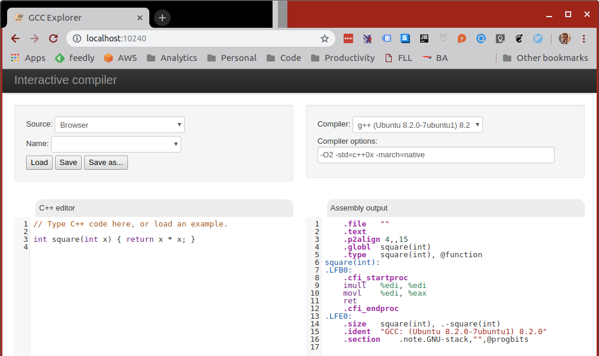

<div class="white-bg">

### Overview
* Intro & History
* Some Cool Features
* Behind the Scenes

</div>

---
    
<div class="white-bg">

### About me

* Decade of making console games
* Writing C++ tools
* Google, YouTube mobile
* Finance
* But then...<!-- .element: class="fragment" -->

</div>

---

<div class="white-bg">

 <!-- .element: class="no-border stretch" -->

</div>

---

<div class="white-bg">

### Origin Story

```bash
watch "g++ /tmp/test.cc -std=c++0x -O2 -c -S -o - -masm=intel \
    | c++filt \
    | grep -vE '\s+\.'"
```
<!-- .element: class="fragment" -->

</div>

---


---

<div class="white-bg">

## Origin Story

* Great
* But not pretty
* TO THE WEB!<!-- .element: class="fragment" -->

</div>

---

### GCC Explorer!
<!-- .element: class="white-bg" -->
<!-- .element: height="470" class="no-border" -->

---

### Today

<!-- .element: class="white-bg" -->
<!-- .element: height="470" class="no-border" -->

---

<div class="white-bg">

### Evolution: 2012-2017
  * Colouration & filtering
  * More compilers
  * New languages: D & Rust
  * Short links
  * Binary support
  * GoldenLayout
  * Monaco
  * Libraries

</div>

---

<div class="white-bg">

### Evolution: 2018-2024
  * More languages: now 65+
  * Dark mode
  * Tools windows (15+)
  * User code execution
  * Multiple source files (`cmake`)
  * Windows, ARM & GPU
  * Better compiler picker (now we have 3000+)
  * Ported to TypeScript internally

</div>
